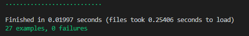

# Tic-tac-toe

The classic tic-tac-toe game to be played in your terminal.


## About the Project

This project implements the tic-tac-toe game using object-oriented Ruby.

## Built With

- Ruby
- Visual Studio, Git & GitHub

## About Tic-tac-toe

Tic-tac-toe is a game for two players, "X" and "O", who take turns marking the spaces in a 3×3 grid.

The player who succeeds in placing three of their marks in a horizontal, vertical, or diagonal row is the winner.

## Getting Started

### Prerequisites

- Ruby
- A terminal

### Setup

- Clone or download this repository
- If necessary, unzip the downloaded directory

### Usage

- Go into the "tic-tac-toe" directory
- Execute the "main.rb" file

```
./bin/main.rb
```

- Follow the "How to play" instructions

## How to Play

1. The first player (Player 1) will choose their symbol "X" or "O". The remaining symbol will be assigned to the other player (Player 2);
2. Enter Player 1's name;
3. Enter Player 2's name;
4. Starting with Player 1, turn after turn, each player will type a number (1 to 9) corresponding to their desired movement;
5. The players continue making movements until one of them get three of their marks in a horizontal, vertical, or diagonal row;
6. If no player gets three of their marks in a row after all the board's spots are marked, the game ends in a draw.


### Testing methods



For testing please escute the next steps:

- Execute the following code on the terminal to get the Gems needed:

```
bundle install
```

- Run the test with the following command:

```
rspec
```

## Authors

👨‍💻 **Elbert Corniell**

- GitHub: [@elberthcorniell](https://github.com/elberthcorniell)
- Twitter: [@elberthcorniell](https://twitter.com/elberthcorniell)
- LinkedIn: [Elbert Corniell](https://www.linkedin.com/in/elbert-corniell-989183159/)


👨‍💻 **Breno Xavier**

- GitHub: [@brenoxav](https://github.com/brenoxav)
- Twitter: [@brenoxav](https://twitter.com/brenoxav)
- LinkedIn: [Breno Xavier](https://www.linkedin.com/in/brenoxav)


## 🤝 Contributing

Contributions, issues, and feature requests are welcome!

Feel free to check the [issues page](https://github.com/brenoxav/tic-tac-toe/issues).


## Show your support

Give a ⭐️ if you like this project!


## 📝 License

This project is [MIT](./LICENSE) licensed.