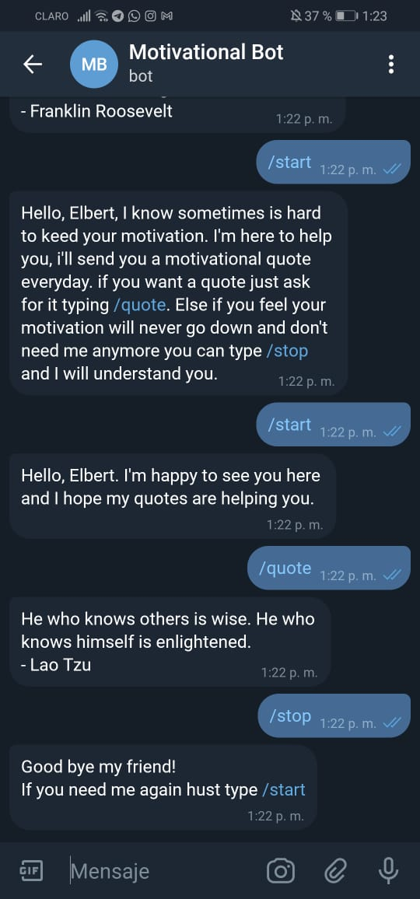

# Telegram Motivational Bot

A Telegram bot to send motivational quotes everyday or whenever you need one

## Bot chat expample



## About the Project

This project implements Telegram bot using Ruby and the help of some gems like:

- telegram-bot-ruby
- json
- net-http-persistent
- whenever
- rspec
- rubocop

## Built With

- Ruby
- Visual Studio, Git & GitHub

## Getting Started

### Prerequisites

- Ruby
- A terminal
- Telegram bot API key

#### How to get a Telegram API key

- Register on Telegram.
- Search for Bot father.
- Type `/new bot` in the chat and follow the instructions.

### Setup

- Clone or download this repository
- If necessary, unzip the downloaded directory
- Replace the "Telegram_Bot_API" value in `config.json` with your API key.
(You can use this one "1482669218:AAF_7ftT-eZPq_OetvSRzq3r5jyYngXnZ04")
    ```
        {
            "telegram_bot_api": "YOUR API KEY HERE"
        }
    ```
- Run:
    ```
        bundle install
    ```

### Usage

- Go into the "telegram-motivational-bot" directory
- Execute the "main.rb" file

```
./bin/main.rb
```
- Your bot is now runing
- Go to the bot chat in Telegram (bot for given API key: @motivatonal_bot)
- Follow the "How to use" instructions

## How to use

To use the bot you can use one of the next commands:

/start - Starts the bot and gets you subscribed to a daily motivational quote.
/quote - Gives you a random quote to improve your motivation level.
/stop - Stops the subscription.

### Default bot

If you used the give API key the bot should be running here:

 [Telegram bot](https://t.me/motivatonal_bot)

### Testing methods


For testing please escute the next steps:

- Execute the following code on the terminal to get the Gems needed:

```
bundle install
```

- Run the test with the following command:

```
rspec
```

## Authors

👨‍💻 **Elbert Corniell**

- GitHub: [@elberthcorniell](https://github.com/elberthcorniell)
- Twitter: [@elberthcorniell](https://twitter.com/elberthcorniell)
- LinkedIn: [Elbert Corniell](https://www.linkedin.com/in/elbert-corniell-989183159/)


## 🤝 Contributing

Contributions, issues, and feature requests are welcome!

Feel free to check the [issues page](https://github.com/elberthcorniell/telegram-motivational-bot/issues).


## Thank's to

- [Free motivational quotes API](https://forum.freecodecamp.org/t/free-api-inspirational-quotes-json-with-code-examples/311373)


## Show your support

Give a ⭐️ if you like this project!


## 📝 License

This project is [MIT](./LICENSE) licensed.